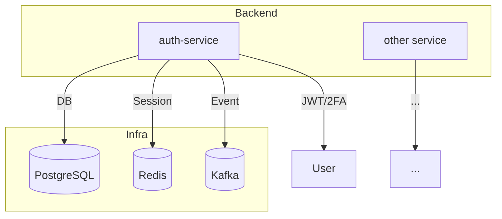

# Music Player Monorepo

## Overview

This is the monorepo for the Music Player system, including multiple backend/frontend services, following a microservices architecture for scalability, maintainability, and rapid development. Each service is modularized, making CI/CD integration, configuration management, and shared resource management easy.

## Directory Structure

- **auth-service/**: Authentication microservice, user management, JWT, 2FA, session, integrated with PostgreSQL, Redis, Kafka.
- **(Other services will be added here)**
- **.git/**: Version control for the entire monorepo.

## Technologies Used

- **Backend**: Golang, Gin, GORM, Redis, PostgreSQL, Kafka, Google Wire, Viper
- **Frontend**: (To be added)
- **DevOps**: Docker Compose, Goose, CI/CD pipeline (suggested: Github Actions, Gitlab CI)
- **Package management**: pnpm (required for frontend, monorepo standard)

## Quick Start

```powershell
# 1. Start supporting services (Postgres, Redis, Kafka, ...)
cd auth-service
powershell -Command "docker compose up -d"

# 2. Set up environment variables for each service
cp .env.example .env

# 3. Run migration (if any)
# goose up

# 4. Build & run each service
# Example for auth-service:
powershell -Command "go run ./cmd/main.go"
```

## Development Rules

- Follow Elite Code Craftsman standards: DRY, SOLID, Separation of Concerns, KISS
- Each service must have its own README.md describing modules, flows, Mermaid diagrams
- Use husky to enforce commit/code quality
- Track progress in `plan-tracking.md` or `plan/`

## Mermaid Diagrams

### System Overview



## Contact

- Maintainer: Van Truong Nguyen
- Email: truongnguyen060603@gmail.com

---

_This is the general documentation. Please read each service's README.md for detailed configuration, API, and business flow._
