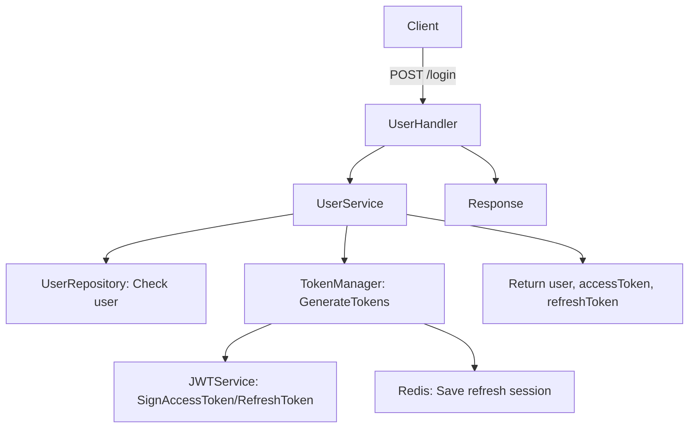
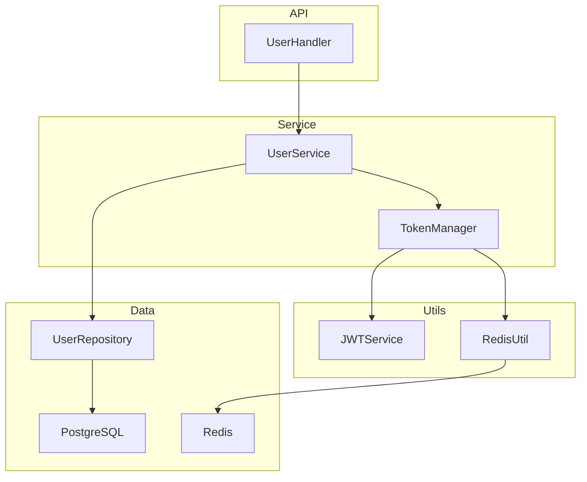
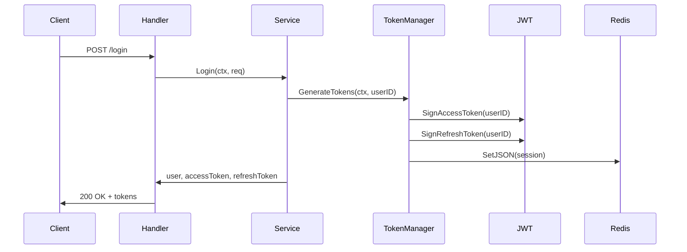

# Auth Service - Music Player Microservice System

## Overview

**Auth Service** là service xác thực và quản lý phiên đăng nhập cho hệ thống Music Player, được phát triển bằng Go, tuân thủ kiến trúc microservice hiện đại.

Service này chịu trách nhiệm:

* Đăng ký, đăng nhập, xác thực người dùng
* Sinh và xác thực JWT (access/refresh token)
* Quản lý session refresh token với Redis (kiểm soát đa thiết bị, bảo mật)
* Hỗ trợ 2FA (Two-Factor Authentication)
* Tích hợp Kafka cho các sự kiện xác thực (có thể mở rộng)
* Đảm bảo separation of concerns, DI chuẩn hóa với Google Wire

## Key Components

* **Gin**: Web framework cho REST API
* **JWT**: Sinh, xác thực access/refresh token, lưu session refresh vào Redis
* **Redis**: Lưu session refresh token, kiểm soát đăng nhập đa thiết bị
* **PostgreSQL**: Lưu trữ thông tin user
* **Kafka**: Gửi sự kiện xác thực (có thể mở rộng)
* **Google Wire**: Dependency Injection chuẩn hóa, dễ test, dễ maintain
* **Viper**: Quản lý cấu hình, biến môi trường
* **2FA**: Hỗ trợ xác thực hai lớp

## Folder Structure

```
auth-service/
├── cmd/               # Entrypoint, wire DI, khởi tạo app
├── configs/           # Cấu hình app, DB, Redis
├── internal/
│   ├── handlers/      # HTTP handlers (REST API)
│   ├── services/      # Business logic (UserService, TokenManager, ...)
│   ├── repositories/  # Data access layer (Postgres)
│   ├── utils/
│   │   ├── jwt/       # JWT utils: sign, verify, config, claims, errors
│   │   └── redis/     # Redis helper
│   └── dto/           # Định nghĩa request/response object
├── .env.example       # Mẫu biến môi trường
├── README.md          # Tài liệu này
└── ...
```

## Environment Configuration

Xem file `.env.example` để biết các biến môi trường cần thiết.

**Lưu ý:** Không commit file `.env` thật lên GitHub.

## Docker Usage

* **Dockerfile**: Gói riêng Auth Service thành image độc lập.
* **docker-compose.yml** (ở root project): Orchestrate toàn bộ hệ thống microservice (auth-service, postgres, redis, kafka, ...).

## Diagrams

### Flowchart: Đăng nhập & Sinh Token



### Component Diagram



### Sequence Diagram: Đăng nhập



## Development & Contribution

* Clone repository:

  ```bash
  git clone https://github.com/your-org/auth-service.git
  ```
* Copy `.env.example` thành `.env` và điều chỉnh biến môi trường.
* Build & chạy local:

  ```bash
  docker-compose up --build
  ```
* Chạy unit test:

  ```bash
  go test ./...
  ```

## Notes

✅ Tích hợp dễ dàng vào hệ thống microservice Music Player với event-driven architecture.

✅ Gọn nhẹ, dễ mở rộng, dễ maintain.

✅ Có thể triển khai production thông qua Kubernetes hoặc ECS sau khi kiểm tra ổn định.

---

Nếu cần tài liệu chi tiết hơn về **API Docs, event schema Kafka, hoặc CI/CD workflow**, vui lòng liên hệ DevOps/Tech Lead hoặc gửi yêu cầu qua GitHub Issues.
