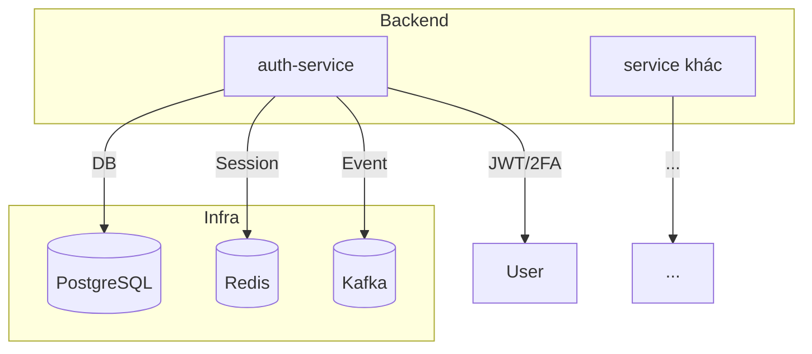

# Music Player Monorepo

## Tổng quan

Đây là monorepo cho hệ thống Music Player, bao gồm nhiều service backend/frontend, triển khai kiến trúc microservices, hỗ trợ mở rộng, bảo trì và phát triển nhanh chóng. Mỗi service được tổ chức module hóa, dễ dàng tích hợp CI/CD, quản lý cấu hình, tài nguyên dùng chung.

## Cấu trúc thư mục

- **auth-service/**: Microservice xác thực, quản lý người dùng, JWT, 2FA, session, tích hợp PostgreSQL, Redis, Kafka.
- **(Các service khác sẽ bổ sung tại đây)**
- **.git/**: Quản lý version code toàn bộ monorepo.

## Công nghệ sử dụng

- **Backend**: Golang, Gin, GORM, Redis, PostgreSQL, Kafka, Google Wire, Viper
- **Frontend**: (Bổ sung khi có)
- **DevOps**: Docker Compose, Goose, CI/CD pipeline (gợi ý: Github Actions, Gitlab CI)
- **Quản lý package**: pnpm (yêu cầu cho frontend, chuẩn hóa monorepo)

## Hướng dẫn khởi động nhanh

```powershell
# 1. Khởi động các service phụ trợ (Postgres, Redis, Kafka, ...)
cd auth-service
powershell -Command "docker compose up -d"

# 2. Thiết lập biến môi trường cho từng service
cp .env.example .env

# 3. Chạy migration (nếu có)
# goose up

# 4. Build & run từng service
# Ví dụ với auth-service:
powershell -Command "go run ./cmd/main.go"
```

## Quy tắc phát triển

- Tuân thủ chuẩn Elite Code Craftsman: DRY, SOLID, Separation of Concerns, KISS
- Mỗi service cần có README.md riêng, mô tả chi tiết module, flow, sơ đồ Mermaid
- Sử dụng husky để kiểm soát chất lượng commit/code
- Ghi chú tiến trình vào `plan-tracking.md` hoặc `plan/`

## Mermaid Diagrams

### Tổng quan hệ thống



---

_Đây là tài liệu tổng quan. Vui lòng đọc README.md của từng service để biết chi tiết cấu hình, API, flow nghiệp vụ._
