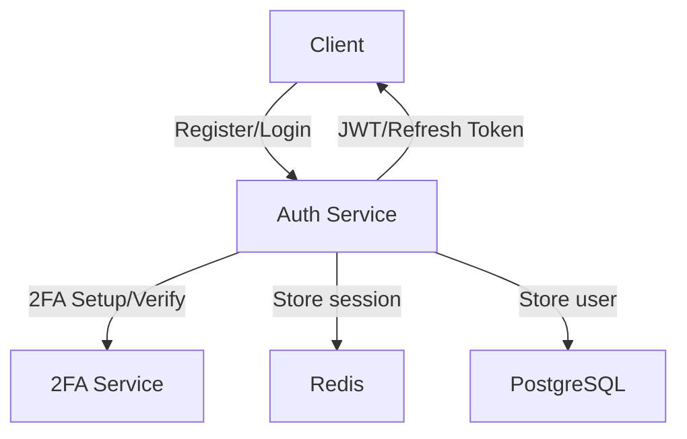
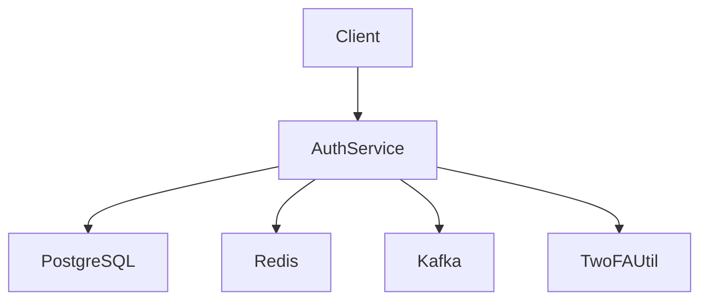
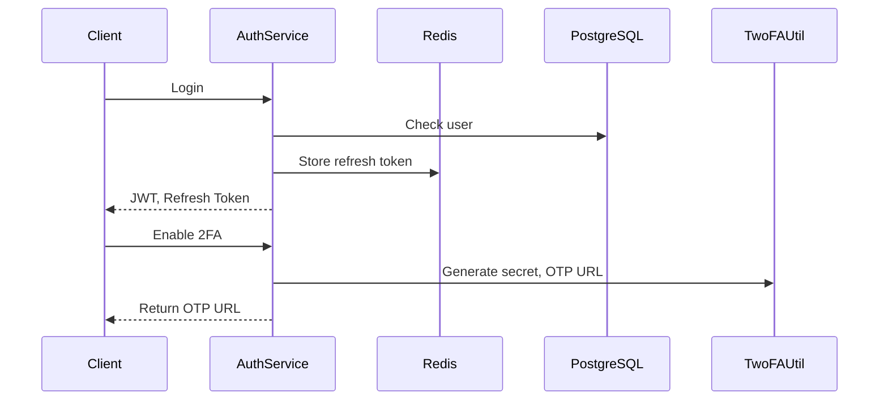

# Auth Service

## Overview

**Auth Service** is a robust user authentication microservice built with Golang, featuring modular architecture, multi-factor authentication (2FA), JWT, session management, and integration with PostgreSQL, Redis, and Kafka. This service is the security foundation for the Music Player system, ensuring safety, scalability, and maintainability.

## Key Components

- **cmd/**: Application entry point, initializes configuration, router, DI.
- **configs/**: Manages app, database, redis, kafka configuration.
- **internal/domain/**: Defines entities, errors, core business logic.
- **internal/dto/**: Defines API request/response structs.
- **internal/handlers/**: Handles HTTP requests for user, 2FA.
- **internal/repositories/**: Data access (PostgreSQL) for users.
- **internal/services/**: Business logic for user, 2FA, token.
- **internal/utils/**: Utilities for JWT, Redis, 2FA, response helpers.
- **migrations/**: Database schema and migration scripts.
- **docker-compose.yml**: Quick start for Redis, Postgres, Kafka, Zookeeper, Kafka UI, PgAdmin.

## Quick Start

```bash
# 1. Start supporting services
cd auth-service
# Use PowerShell:
docker compose up -d

# 2. Set up environment variables (.env)
# Copy from .env.example and edit if needed
cp .env.example .env

# 3. Run migration (if using goose)
# goose up

# 4. Build & run the service
# (Requires Go >= 1.20)
go mod tidy
go run ./cmd/main.go
```

## API Features

- Register, login, JWT authentication
- Session management with refresh tokens stored in Redis
- Enable and verify 2FA (TOTP)
- Standardized RESTful API, clear error responses

## Mermaid Diagrams

### Flowchart



### Component Diagram



### Sequence Diagram



## Development Notes

- Standardized code, clear module separation, easy to extend
- Uses DI (Google Wire), Gin, GORM, Viper, Goose, JWT, Redis, Kafka
- Ensures DRY, SOLID, Separation of Concerns
- Includes migration, .env example, docker-compose

## Contact

- Maintainer: Van Truong Nguyen
- Email: truongnguyen060603@gmail.com

---

_Please read the code and documentation carefully before deploying. Contributions, issues, and PRs are always welcome!_
