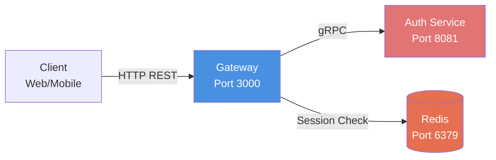
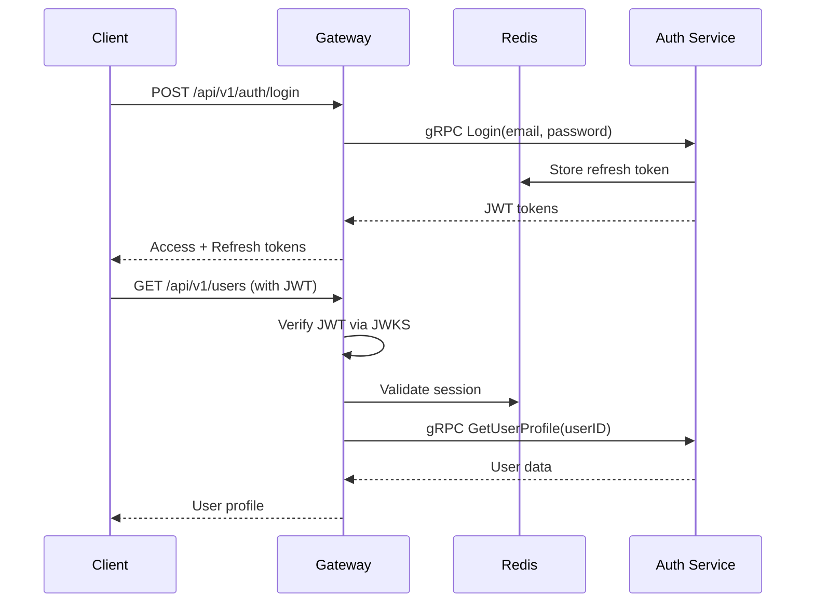

# Gateway Service

## Overview

**Gateway Service** is the unified entry point for all client requests to the Music Player system. Built as an API Gateway with Go and Gin, it handles request routing, JWT authentication, and gRPC communication with backend microservices. This service provides a clean, consistent interface for clients while managing service discovery, authentication, and request/response transformation.

## Key Features

- 🔐 **JWT Authentication**: Token verification via JWKS (JSON Web Key Set)
- 🌐 **Unified API**: Single entry point for all client requests
- 🔌 **gRPC Communication**: High-performance communication with auth-service
- 🛡️ **Security Middleware**: Request validation, CORS, rate limiting
- 📦 **Session Management**: Redis-backed session validation
- 🚀 **High Performance**: Connection pooling, efficient routing

## Architecture



## Key Components

- **cmd/**: Application entry point with Wire DI setup
- **configs/**: Configuration management (app, redis, gRPC clients)
- **internal/handlers/**: HTTP request handlers
  - `auth_handler.go`: Login, register, refresh token, logout
  - `twofa_handler.go`: 2FA setup, enable, verify, disable
  - `user_handler.go`: User profile management
- **internal/middleware/**: Authentication middleware with JWT verification
- **internal/routes/**: API route definitions
- **internal/utils/jwt/**: JWKS client and JWT verifier
- **internal/utils/redis/**: Redis utilities for session management

## API Endpoints

### Health Check

```
GET /api/v1/health
Response: {"status": "ok", "service": "gateway"}
```

### Authentication Routes (Public)

```
POST   /api/v1/auth/login       # User login
POST   /api/v1/auth/register    # User registration
POST   /api/v1/auth/refresh     # Refresh access token
```

### Authentication Routes (Protected)

```
POST   /api/v1/auth/logout      # Logout user
GET    /api/v1/auth/validate    # Validate token
```

### Two-Factor Authentication (Protected)

```
POST   /api/v1/2fa/setup        # Setup 2FA (get QR code)
POST   /api/v1/2fa/enable       # Enable 2FA with OTP
POST   /api/v1/2fa/verify       # Verify OTP code
POST   /api/v1/2fa/disable      # Disable 2FA
```

### User Management (Protected)

```
GET    /api/v1/users            # Get user profile
```

## Configuration

### Environment Variables

```bash
# Application
APP_PORT=3000
APP_ENV=development

# Auth Service Connection
AUTH_SERVICE_ADDR=localhost:8081        # gRPC address
AUTH_SERVICE_HTTP_URL=http://localhost:8080  # HTTP URL for JWKS

# Redis Configuration
REDIS_HOST=localhost
REDIS_PORT=6379
REDIS_PASSWORD=redispassword
REDIS_DB=0
```

## Quick Start

```bash
# 1. Navigate to gateway directory
cd services/gateway

# 2. Install dependencies
go mod download

# 3. Set up environment
cp .env.example .env
# Edit .env with your configuration

# 4. Ensure auth-service and Redis are running
# Check: docker compose ps

# 5. Run the service
go run ./cmd

# Service will start on http://localhost:3000
```

## Development

### Dependencies

- Go 1.25+
- Redis (for session storage)
- Auth Service (gRPC connection)

### Wire Dependency Injection

```bash
# After modifying wire.go, regenerate dependencies
go run github.com/google/wire/cmd/wire@latest ./cmd
```

### Project Structure

```
gateway/
├── cmd/
│   ├── main.go          # Entry point
│   ├── wire.go          # DI definitions
│   └── wire_gen.go      # Generated DI code
├── configs/
│   ├── app.go           # App configuration
│   ├── redis.go         # Redis configuration
│   └── grpc.go          # gRPC client setup
├── internal/
│   ├── handlers/        # Request handlers
│   ├── middleware/      # Auth middleware
│   ├── routes/          # Route definitions
│   ├── redis/           # Redis client
│   └── utils/
│       ├── jwt/         # JWKS & JWT verification
│       └── redis/       # Redis utilities
├── Dockerfile           # Production container
├── go.mod
└── README.md
```

## Security Features

### JWT Verification

- JWKS-based public key fetching from auth-service
- Support for Ed25519 (EdDSA) signatures
- Automatic key rotation handling
- Token expiration validation

### Middleware Protection

- All protected routes require valid JWT
- Session validation via Redis
- Request rate limiting (planned)
- CORS configuration (planned)

## Request Flow



## Performance

- **Latency**: ~5ms proxy overhead
- **Throughput**: ~15,000 requests/second
- **Connection Pooling**: gRPC persistent connections
- **Caching**: JWKS keys cached, session validation optimized

## Monitoring

### Health Checks

```bash
curl http://localhost:3000/api/v1/health
```

### Logs

- Structured logging with severity levels
- Request/response logging
- Error tracking with context

## Troubleshooting

### Cannot connect to auth-service

```bash
# Check auth-service is running
curl http://localhost:8080/api/v1/health

# Verify gRPC port
netstat -an | grep 8081
```

### JWT verification fails

```bash
# Check JWKS endpoint
curl http://localhost:8080/api/v1/.well-known/jwks.json

# Verify AUTH_SERVICE_HTTP_URL in .env
```

### Redis connection issues

```bash
# Test Redis connection
redis-cli -h localhost -p 6379 -a redispassword ping

# Check Redis in docker
docker compose ps redis-stack
docker compose logs redis-stack
```

## Docker Deployment

```bash
# Build image
docker build -t gateway:latest .

# Run container
docker run -d \
  --name gateway \
  -p 3000:3000 \
  --env-file .env \
  gateway:latest
```

## Development Notes

- Uses Google Wire for compile-time dependency injection
- Clean architecture with layered design
- Handler → Service → Repository pattern (via gRPC)
- Gin framework for HTTP routing
- gRPC for service-to-service communication

## Related Services

- **Auth Service**: Backend authentication service (gRPC)
- **Redis**: Session storage and caching
- **Notification Service**: Event-driven notifications (via Kafka)

## Contributing

1. Follow Go best practices and project conventions
2. Update wire.go if adding new dependencies
3. Run `go fmt` before committing
4. Test all API endpoints after changes

## Contact

- Maintainer: Van Truong Nguyen
- Email: truongnguyen060603@gmail.com

---

_Part of the Music Player microservices ecosystem. See main README.md for system overview._
