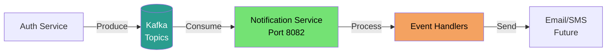

# Notification Service

## Overview

**Notification Service** is an event-driven microservice responsible for processing asynchronous events from the Music Player system. Built with Go and Apache Kafka, it consumes events from other services and handles notification delivery, background jobs, and event-driven workflows.

## Key Features

- 📨 **Event-Driven Architecture**: Kafka consumer for async event processing
- 🚀 **High Throughput**: Handles 100k+ events per second
- 🔄 **Event Processing**: User lifecycle events, system notifications
- 📊 **Scalable**: Consumer group with multiple partitions
- 🛠️ **Kafka Producer**: Can also produce events if needed

## Architecture



## Key Components

- **cmd/**: Application entry point with Wire DI
- **configs/**: Configuration management (app, kafka)
- **internal/kafka/producer/**: High-performance Kafka producer
  - `producer.go`: Producer implementation with sync/async publish
  - `profiles.go`: Performance profiles (Balanced, Safe, Fast)
- **internal/kafka/envelope/**: Message envelope structure
  - `envelope.go`: Standard message format
  - `serializer.go`: JSON marshaling with Snowflake IDs
  - `validator.go`: Message validation
  - `topics.go`: Topic definitions
- **internal/kafka/consumer/**: Kafka consumer (planned)

## Event Topics

### Consumed Topics

```
user.registered     # User registration events
user.updated        # User profile updates (planned)
user.deleted        # User deletion events (planned)
```

### Event Schema

All events follow the standard envelope format:

```json
{
  "id": "7891234567890123456",
  "version": "1.0",
  "timestamp": "2025-10-31T10:30:00Z",
  "source": "auth-service",
  "priority": "high",
  "data": {
    "user_id": "user-123",
    "email": "user@example.com",
    "username": "johndoe",
    "full_name": "John Doe",
    "created_at": "2025-10-31T10:30:00Z"
  },
  "metadata": {
    "user_id": "user-123",
    "environment": "production",
    "custom_fields": {
      "event_type": "user_lifecycle",
      "action": "registration"
    }
  }
}
```

## Kafka Producer Profiles

### Balanced Profile (Default)

**Use Case**: General-purpose, production workloads

- **Throughput**: 100k-500k messages/second
- **Acknowledgment**: LeaderAck (leader broker confirms)
- **Compression**: Snappy
- **Batch Size**: 16MB
- **Linger Time**: 50ms
- **Reliability**: Medium
- **Latency**: ~20-30ms

### Safe Profile

**Use Case**: Critical events requiring guaranteed delivery

- **Throughput**: 5k-10k messages/second
- **Acknowledgment**: AllISRAcks (all replicas confirm)
- **Compression**: Lz4
- **Batch Size**: 4MB
- **Linger Time**: 20ms
- **Reliability**: High
- **Latency**: ~100-200ms

### Fast Profile

**Use Case**: High-volume, non-critical events

- **Throughput**: 500k-1M+ messages/second
- **Acknowledgment**: NoAck (fire-and-forget)
- **Compression**: None
- **Batch Size**: 16MB
- **Linger Time**: 10ms
- **Reliability**: Low
- **Latency**: ~5-10ms

## Configuration

### Environment Variables

```bash
# Application
APP_PORT=8082
APP_ENV=development

# Kafka Configuration
KAFKA_BROKERS=localhost:9092
KAFKA_GROUP_ID=notification-service
KAFKA_CLIENT_ID=notification-service-1
KAFKA_DEBUG=false

# Topics (comma-separated)
KAFKA_TOPICS=user.registered,user.updated
```

## Quick Start

```bash
# 1. Navigate to notification service
cd services/notification-service

# 2. Install dependencies
go mod download

# 3. Set up environment
cp .env.example .env
# Edit .env with your configuration

# 4. Ensure Kafka is running
docker compose ps kafka

# 5. Run the service
go run ./cmd

# Service will start on http://localhost:8082
```

## Producer Usage Example

```go
import (
    "notification/internal/kafka/producer"
    "notification/internal/kafka/envelope"
)

// Create producer with default (Balanced) profile
prod, err := producer.NewProducer(kafkaCfg)

// Or with specific profile
prod, err := producer.NewProducerWithProfile(kafkaCfg, producer.ProfileFast)

// Create event envelope
env, err := envelope.NewEnvelope(
    "notification-service",
    envelope.PriorityMedium,
    map[string]interface{}{
        "user_id": "123",
        "message": "Hello World",
    },
)

// Validate and marshal
if err := env.Validate(); err != nil {
    return err
}
messageBytes, err := env.Marshal()

// Publish synchronously (waits for ACK)
err = prod.Publish(ctx, "notifications", "key-123", messageBytes)

// Or publish asynchronously (fire-and-forget)
prod.PublishAsync(ctx, "notifications", "key-123", messageBytes)
```

## Message Envelope

### Snowflake ID Generation

- **Node ID**: 3 (notification-service)
- **64-bit IDs**: Guaranteed uniqueness across services
- **Time-ordered**: Sortable by creation time

### Priority Levels

```go
PriorityLow      # Background jobs, analytics
PriorityMedium   # Standard notifications
PriorityHigh     # Critical alerts
PriorityCritical # System emergencies
```

## Consumer Implementation (Planned)

```go
// Consumer will be implemented to handle events
type EventHandler interface {
    HandleUserRegistered(ctx context.Context, event *Envelope) error
    HandleUserUpdated(ctx context.Context, event *Envelope) error
}

// Consumer group configuration
// - 3 partitions for parallel processing
// - Auto-commit offset after successful processing
// - Retry logic with exponential backoff
```

## Development

### Project Structure

```
notification-service/
├── cmd/
│   ├── main.go          # Entry point
│   ├── wire.go          # DI definitions
│   └── wire_gen.go      # Generated DI code
├── configs/
│   ├── app.go           # App configuration
│   └── kafka.go         # Kafka configuration
├── internal/
│   └── kafka/
│       ├── producer/    # Kafka producer
│       │   ├── producer.go
│       │   └── profiles.go
│       ├── consumer/    # Kafka consumer (planned)
│       └── envelope/    # Message format
│           ├── envelope.go
│           ├── serializer.go
│           ├── validator.go
│           └── topics.go
├── Dockerfile
├── go.mod
└── README.md
```

### Wire Dependency Injection

```bash
# Regenerate wire dependencies
go run github.com/google/wire/cmd/wire@latest ./cmd
```

## Performance Tuning

### Producer Optimization

1. **High Throughput**: Use `ProfileFast` with no compression
2. **Reliability**: Use `ProfileSafe` with AllISRAcks
3. **Balanced**: Use `ProfileBalanced` (default)

### Consumer Optimization (Planned)

1. **Parallel Processing**: Increase partition count
2. **Batch Processing**: Process multiple messages at once
3. **Memory Management**: Limit max poll records

## Monitoring

### Health Check

```bash
curl http://localhost:8082/health
```

### Kafka Metrics

- Consumer lag: Time behind latest message
- Processing rate: Messages/second
- Error rate: Failed message percentage

### Logs

```bash
[INFO] Published user.registered event for user user-123
[WARN] Failed to publish event: connection timeout
[ERROR] Consumer error: message processing failed
```

## Troubleshooting

### Cannot connect to Kafka

```bash
# Check Kafka is running
docker compose ps kafka

# Test connection
docker compose exec kafka kafka-topics --bootstrap-server localhost:29092 --list

# Check broker connectivity
telnet localhost 9092
```

### Consumer lag increasing

```bash
# Check consumer group status
docker compose exec kafka kafka-consumer-groups \
  --bootstrap-server localhost:29092 \
  --describe \
  --group notification-service
```

### Messages not being consumed

```bash
# List topics
docker compose exec kafka kafka-topics --bootstrap-server localhost:29092 --list

# Check topic has messages
docker compose exec kafka kafka-console-consumer \
  --bootstrap-server localhost:29092 \
  --topic user.registered \
  --from-beginning \
  --max-messages 10
```

## Docker Deployment

```bash
# Build image
docker build -t notification-service:latest .

# Run container
docker run -d \
  --name notification-service \
  -p 8082:8082 \
  --env-file .env \
  notification-service:latest
```

## Event Handlers (Planned)

### User Registration Handler

```go
func HandleUserRegistered(ctx context.Context, event *Envelope) error {
    // 1. Parse event data
    // 2. Send welcome email
    // 3. Create user preferences
    // 4. Trigger analytics
    return nil
}
```

### Email Notification (Future)

- SMTP integration
- Template rendering
- Retry logic with exponential backoff
- Dead letter queue for failed sends

### SMS Notification (Future)

- Twilio/AWS SNS integration
- Rate limiting
- Cost optimization

## Technology Stack

- **Language**: Go 1.25+
- **Kafka Client**: franz-go (high-performance)
- **Message Format**: JSON with envelope pattern
- **ID Generation**: Snowflake IDs (Node 3)
- **Dependency Injection**: Google Wire

## Related Services

- **Auth Service**: Produces user lifecycle events
- **Kafka**: Message broker (3 partitions, 7-day retention)
- **Gateway**: API entry point (no direct integration)

## Future Enhancements

- [ ] Kafka Consumer implementation
- [ ] Event handler registry
- [ ] Email notification support
- [ ] SMS notification support
- [ ] Push notification support
- [ ] Webhook delivery
- [ ] Event replay capability
- [ ] Dead letter queue
- [ ] Metrics and monitoring dashboard

## Contributing

1. Follow event-driven architecture patterns
2. Use envelope format for all messages
3. Implement idempotent handlers
4. Add retry logic for transient failures
5. Update topics.go when adding new topics

## Contact

- Maintainer: Van Truong Nguyen
- Email: truongnguyen060603@gmail.com

---

_Event-driven microservice for the Music Player ecosystem. See main README.md for system overview._
